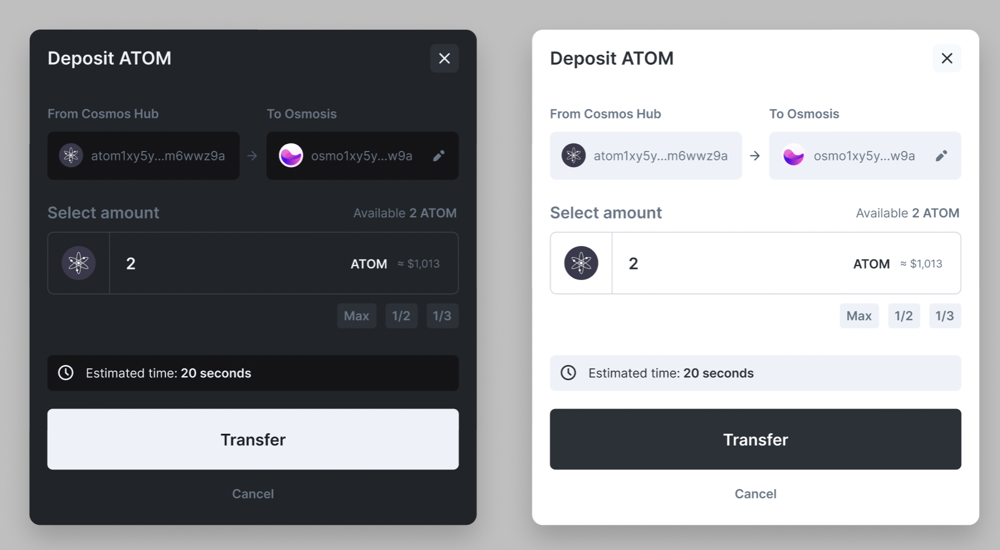

# UI Challenge

## Target

Make an UI Component as follows

## Notes

- Using `Styled Component` only. Don't use any UI Kit.
- `Theme` is optional.
- Static component. No need to add functionalities.

## Material

- [Material](https://github.com/marslavish/code-challenge-v2/tree/main)
